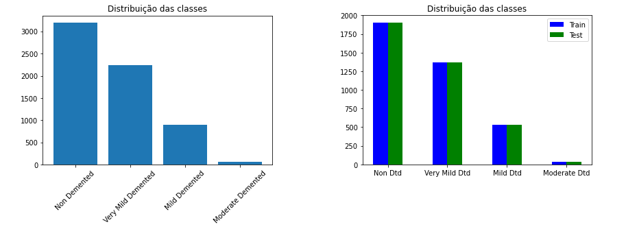

# Classifying levels of Alzheimer's disease using MRI and machine learning

The objective of this project is to test different machine learning classification algorithms paired with different
image processing techniques. Additionally, we will use the trained models to predict the level of dementia
based on the MRI images.

This project was developed for a Machine Learning class at the University of São Paulo (USP) in 2021. Because of this, most of the reports are in Portuguese.
I will try to translate them to English as soon as possible. For now use this markdown file as a guide to the project.

## Relevancy of the project

Alzheimer's disease is a neurodegenerative disease that affects millions of people worldwide. The disease is known for a really complex diagnosis process, which involves a lot of different exams and specialists.
The early detection of the disease is crucial for the patient's treatment and quality of life. 
The use of machine learning algorithms to classify the level of dementia based on MRI images can help doctors to diagnose the disease more accurately and quickly.

## Dataset Information

* The dataset can be accessed on [Kaggle](https://www.kaggle.com/datasets/navoneel/brain-mri-images-for-brain-tumor-detection).
* 6400 MRI images of the brain.
* Resolution is 128x128 pixels.
* Grayscale images.

An example of the images can be seen on Figure 1.
<figure align="center">
    
</figure>

*Figure 1. Example of a MRI Image from the dataset.*

### Classes
The dataset is divided into 4 classes: 
* Non-Demented.
* Very Mild Demented.
* Mild Demented.
* Moderate Demented.
  
The classes are unbalanced, with the majority of the images being classified as Non-Demented.
To account for this factor the same distribution of classes was maintained for the training and test sets, as shown on Figure 2.
<figure align="center">
    
</figure>

*Figure 2. Bar graph of the original class distribution from the dataset on the left; Bar graph showing the same class distribution being kept for the train and test set on the right.*

## Models Tested
* K-Nearest Neighbors *(KNN)*.
* Decision Tree *(DT)*.
* Support Vector Machine *(SVM)*.
* Multilayer Perceptron *(MLP)*.
* Convolutional Neural Network *(CNN)8.

## Image Processing

First, different levels of Gaussian blur (**Figure 3**) were applied to the images to evaluate how this would affect the performance of each model. Moreover, a Local Binary Pattern (LBP) (**Figure 4**) was employed to extract features from the images for the KNN and Decision Tree models. Next, for the SVM a 
Histogram of Oriented Gradients (HOG) (**Figure 5** illustrates better how this method works with an image of a dog) was implemented to extract a gradient map from the images. The only treatment for the MLP and CNN models was the Gaussian blur.

## Grid Search and Cross Validation

Grid search and cross validation methods were employed to ensure that all of the models had the best parameters possible.

## Results

## Improvements
- [ ] Show models architecture.
- [ ] Translate reports to English.
- [ ] Organize each model in a different file.

## References 

* https://repositorio.unesp.br/bitstream/handle/11449/151042/padovese_bt_me_sjrp.pdf?sequence=3&isAllowed=y

* GAION, João Pedro de Barros Fernandes. Doença de Alzheimer: saiba mais sobre a principal causa de demência no mundo. saiba mais sobre a principal causa de demência no mundo. 2020. Disponível em: https://www.informasus.ufscar.br/doenca-de-alzheimer-saiba-mais-sobre-a-principal-causa-de-demencia-no-mundo/. Acesso em: 20 abr. 2022.

* ALZHEIMER'S ASSOCIATION. Alzheimer e demência no Brasil. 20--?. Disponível em: https://www.alz.org/br/demencia-alzheimer-brasil.asp. Acesso em: 20 abr. 2022.

* NAZARÉ, Thiago Santana de, et. al. Deep Convolutional Neural Networks and Noisy Images. Disponível em: https://sites.icmc.usp.br/moacir/papers/Nazare_CIARP2017_DNN-Noise.pdf. Acesso em: 22 abr. 2022.

* CNN Model Architecture: https://ieeexplore.ieee.org/document/9215402
